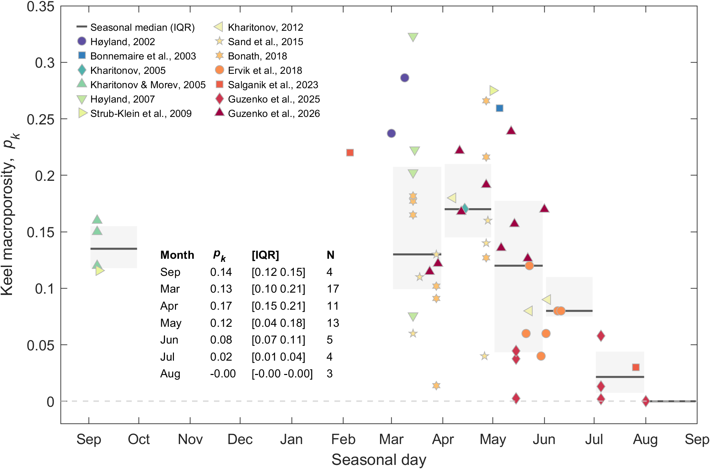

# Ridge keel porosity dataset

## Overview

This MATLAB script compiles published observations of **sea-ice ridge keel macroporosity** and analyses their seasonal evolution across the Arctic.

### Methodology

- Literature data are harmonized into a unified table structure
- Where not directly reported, keel porosity is computed as:
  
  p_k = p_r · (h_k − h_c) / h_k  

  where:
  - `h_k` — keel depth  
  - `h_c` — consolidated layer thickness  
  - `p_r` — rubble porosity  

- Observation dates are transformed into a **normalized seasonal coordinate** (“seasonal day”), referenced to a fixed ice-season start (default: 15 August)

- Data are grouped into predefined seasonal bins, and for each bin:
  - Mean pₖ  
  - 95% confidence interval (CI)  
  - Number of observations (N)
    
- Results are visualized as:
  - Scatter points grouped by source  
  - Horizontal mean lines  
  - Shaded ±1σ envelopes (optional)  
  - Embedded table of monthly statistics (mean, 95% CI, and sample size N)

### Output

- Figure showing:
  - Multi-source observations of keel porosity
  - Seasonal mean trend with variability (95% CI)
  - In-figure summary table showing mean ± 95% CI per month
  
## Data sources

- Høyland (2002), Cold Regions Sci. Technol. — https://doi.org/10.1016/S0165-232X(02)00002-2  
- Bonnemaire et al. (2003), POAC — https://poac.com/PapersOnline.html  
- Kharitonov (2005), POAC — https://poac.com/PapersOnline.html  
- Kharitonov & Morev (2005), POAC — https://poac.com/PapersOnline.html  
- Høyland (2007), J. Geophys. Res. — https://doi.org/10.1029/2000JC000526  
- Strub-Klein et al. (2009), POAC — https://poac.com/PapersOnline.html  
- Kharitonov (2012), Cold Regions Sci. Technol. — https://doi.org/10.1016/j.coldregions.2012.05.018  
- Sand et al. (2015), POAC — https://poac.com/PapersOnline.html  
- Bonath (2018), Cold Regions Sci. Technol. — https://doi.org/10.1016/j.coldregions.2018.08.011  
- Ervik et al. (2018), Cold Regions Sci. Technol. — https://doi.org/10.1016/j.coldregions.2018.03.024  
- Salganik et al. (2023), Elementa — https://doi.org/10.1525/elementa.2023.00008  
- Guzenko et al. (2025), IJOPE — https://doi.org/10.17736/ijope.2025.jc943  
- Guzenko et al. (2026), JOES — https://doi.org/10.1016/j.joes.2026.03.004  

### Notes

- Some parameters (e.g., `h_i`, `p_r`) are **derived or approximated** when not explicitly reported; assumptions are documented in the script.
- POAC datasets are referenced via the conference archive, where individual DOIs are unavailable.
